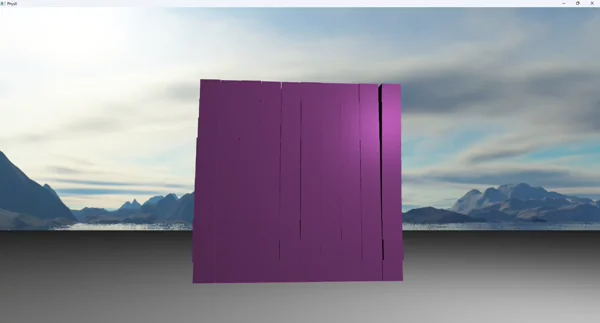

# PhysX OpenGL Interop Demo

A small demo that demonstrates integrating NVIDIA PhysX for real-time rigid-body physics together with OpenGL rendering.

This project shows a stacked grid of cubes simulated by PhysX, a controllable player (capsule controller), a textured sphere you can spawn and shoot, and a skybox.

## **Key features**
- Real-time PhysX rigid body simulation (boxes and spheres).
- OpenGL rendering (GLFW + GLAD + GLM), instanced cube rendering.
- Player movement using a PhysX capsule controller.
- Spawn and launch spheres (left mouse) with simple textured material.
- Skybox and simple lighting.

## Dependencies
- NVIDIA PhysX SDK (binaries and headers)
- GLFW (window/input), GLAD (OpenGL loader), GLM (math), and `stb_image.h` (image loading).

## Controls
- Mouse: look around.
- WASD: move the player (capsule controller).
- Left mouse button: spawn and shoot a textured sphere in the camera direction.